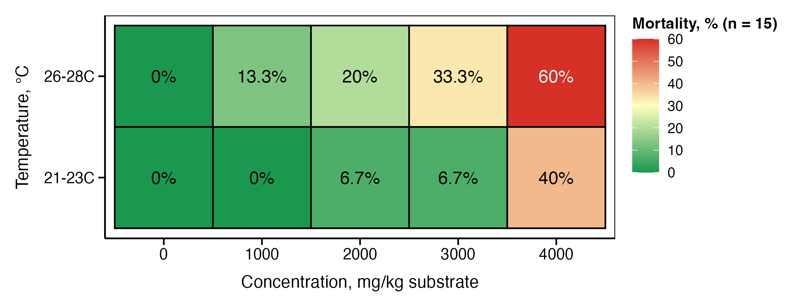
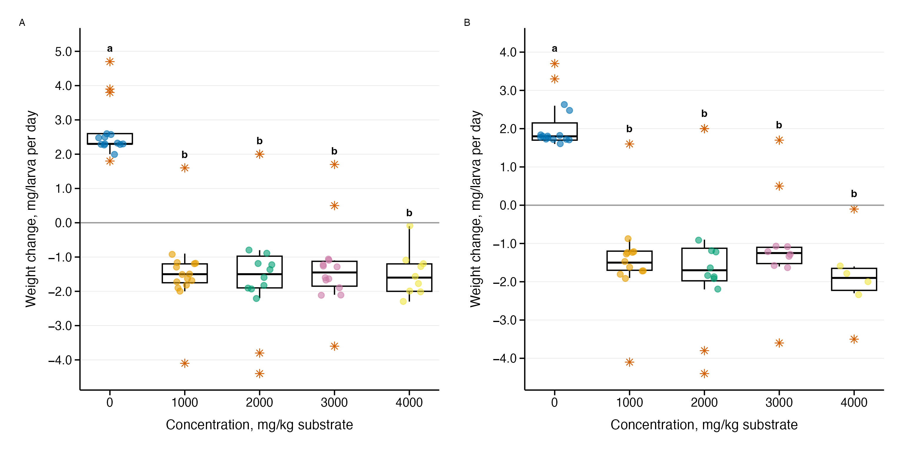
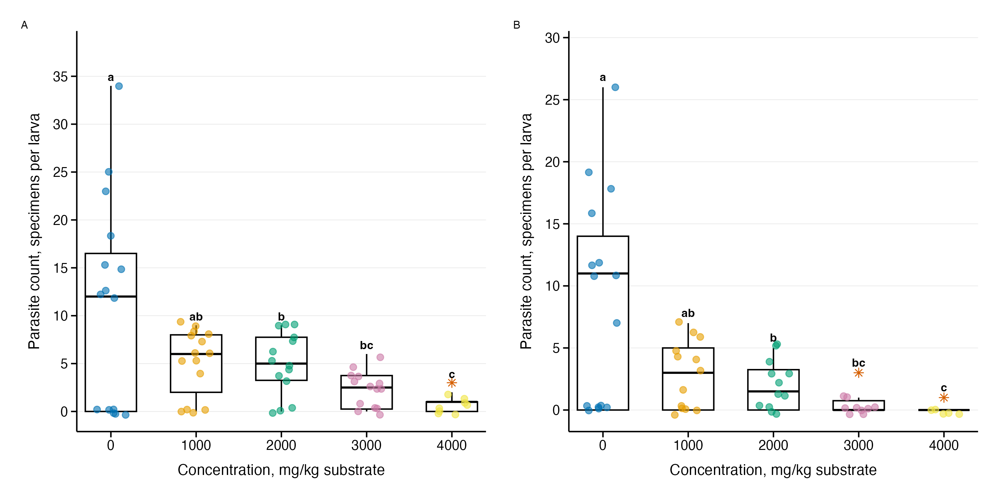
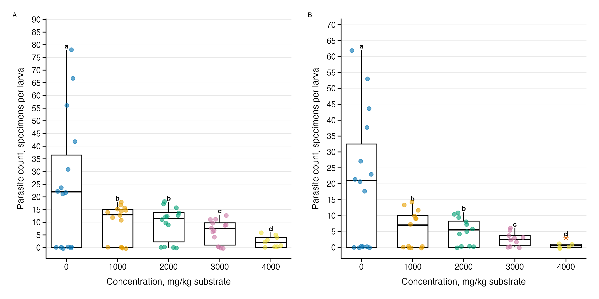
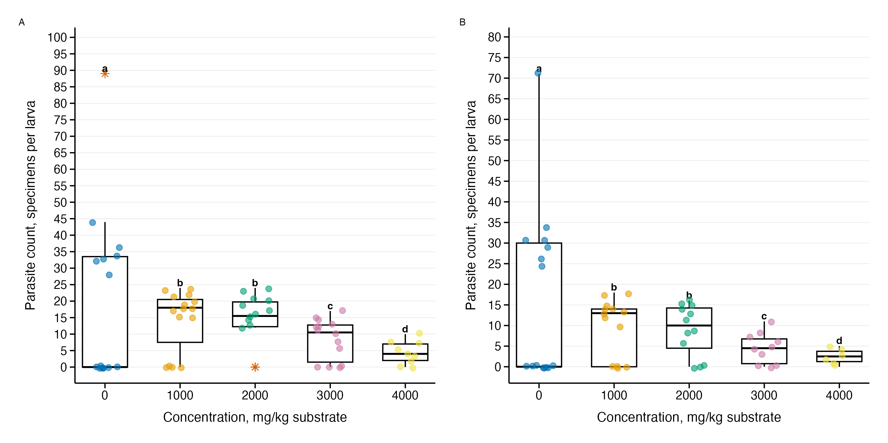
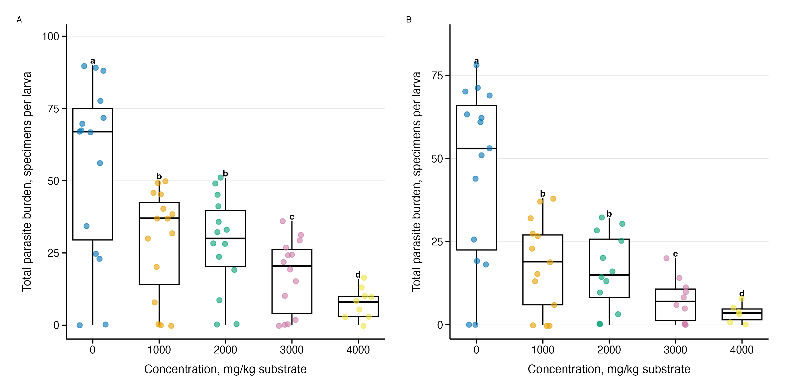

# The effect of ammonia on the host-parasite system Tenebrio molitor at different temperatures

## Abstract

Ammonia (NH3) is an environmental pollutant that enters ecosystems as a result of agricultural activities, industrial accidents, leaks of ammonia-based rocket fuel, and explosions at chemical plants. The degradation of military explosives (TNT, RDX, HMX) in the soils of military conflict zones leads to the release of ammonia as the main product of microbial nitrogen metabolism, creating an additional source of pollution. Temperature changes can alter the toxicity of ammonia to invertebrates, but its impact on host-parasite systems remains poorly understood. This study investigated the effect of ammonia on the relationship between Tenebrio molitor Linnaeus, 1758 (Coleoptera: Tenebrionidae) and its parasites at temperatures of 21–23 °C and 26–28 °C. We used 150 T. molitor larvae, which were divided into five groups of ammonia concentrations (0–4000 mg NH3/kg of substrate) at two temperatures (21–23 °C, 26–28 °C). During a 10-day exposure, mortality, body weight changes and the intensity of parasitic invasion by three species of Gregarina were assessed. The results showed a concentration-dependent effect of ammonia on the physiological state and parasitic systems of T. molitor (body weight changes: p = 2×10-16; intensity of parasitic invasion: R2 = 0.13–0.87), while mortality increased from 0% in the control groups to 40–60% at maximum concentration. Contrary to expectations, temperature did not alter the toxicity of ammonia in the studied range of 21–28 °C (all p > 0.18). Parasitological parameters showed higher sensitivity to ammonium stress compared to physiological indicators, forming 4–5 concentration groups versus 2 groups for body weight changes. The observed absence of temperature-dependent changes in ammonia toxicity in the range of 21–28 °C contrasts with the known effects in aquatic invertebrates and may reflect the physiological characteristics of terrestrial insects. The higher sensitivity of parasitological parameters confirms their suitability as indicators of sublethal toxicity for monitoring ammonium pollution in industrial insect breeding systems.

### Material and methods

The following repository contains all data and metadata for conducting the next analyses:

We conducted all statistical analyses using R version 4.4.2 (R Core Team, 2024) in
RStudio version 2024.12.0+467. We used the following R packages: dplyr (version
1.1.4), ggplot2 (version 3.5.1), and multcompView (version 0.1-10) for post hoc statistical
analysis. We performed one-way analysis of variance (ANOVA) and Tukey's HSD test to
identify pairwise differences between ammonia concentrations, Gregarina abundance, and
changes in T. molitor body mass. We considered differences statistically significant at P
< 0.05.

### Results

Figure 1. Mortality rate of T. molitor larvae under different ammonia concentrations at two temperature regimes (21–23 °C and 26–28 °C).

Figure 2. Changes in body weight of T. molitor larvae: black horizontal line – median, blue diamond – mean, lower and upper boundaries of the rectangle – I and III quartiles, the black vertical line above the box represents the range from the third quartile to the maximum value, and the black vertical line below the box represents the range from the first quartile to the minimum value, the dots represent individual T. molitor specimens, red asterisks representing outliers, values that deviate markedly from the interquartile range (1.5 * IQR), different letters above the boxes indicate statistically significant differences (P < 0.05) between populations according to Tukey's HSD test, the numbers next to the blue line indicate the mean value.

Figure 3. Intensity of Gregarina cuneata infection in T. molitor larvae under ammonia exposure: see Figure 2.

Figure 4. Intensity of Gregarina polymorpha infection in T. molitor larvae under ammonia exposure: see Figure 2.

Figure 5. Intensity of Gregarina steini infection in T. molitor larvae under ammonia exposure: see Figure 2.

Figure 6. Total parasite burden (sum of all Gregarina species) in T. molitor larvae under ammonia exposure: see Figure 2.

#### Keywords:

Tenebrio molitor; Gregarina; ammonia; host-parasite interactions; ecological toxicology; military explosives; TNT degradation.

#### Contributors:

Project lead, biological and ecological reasoning:

Viktor Brygadyrenko

E-Mail: brigad@ua.fm

Research and development, data visualization and aggregation:

Denis Rybalka

E-Mail: denisrybalka89@gmail.com
